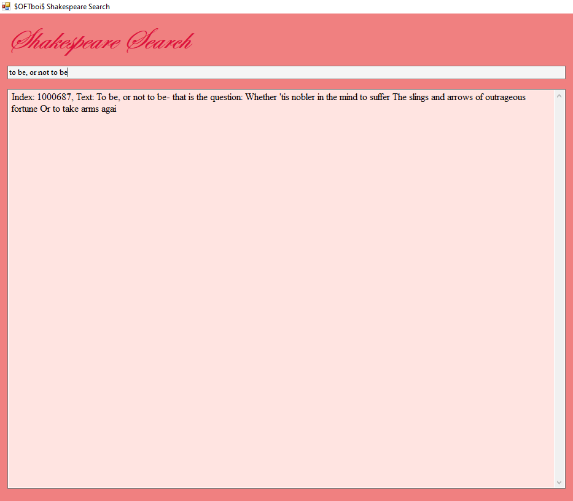

# MP3_Searching_Shakespeares_Complete_Works

**Project builds a suffixtree from a large .txt-file.
Then through a beautiful UI you can search in the text for a typed-in searchstring**

**Can only be run in windows**

**Takes over a minute to run project. Change the textfile to test-text.txt in program.cs for faster time if necessary**

